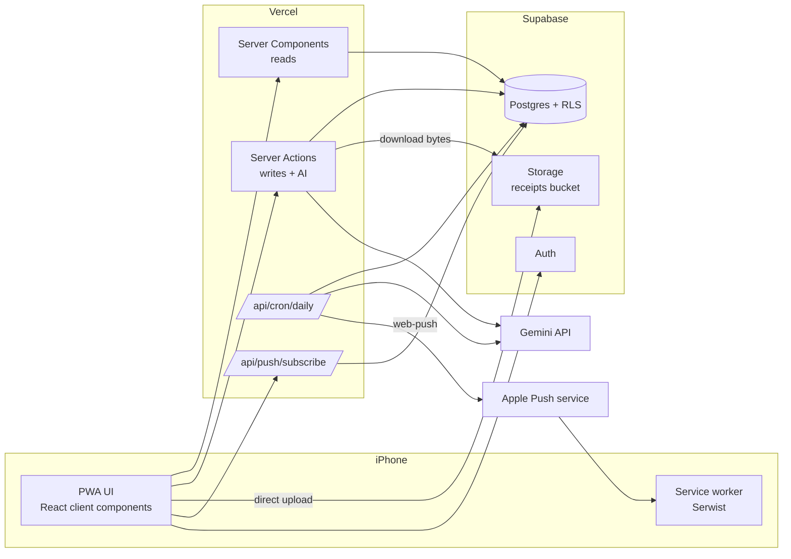
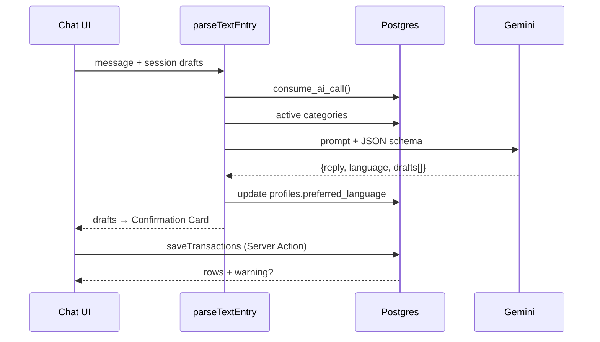
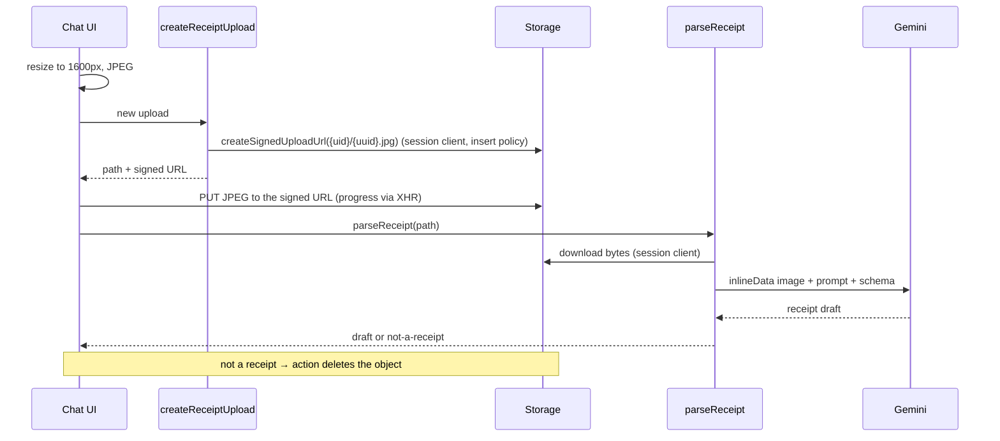
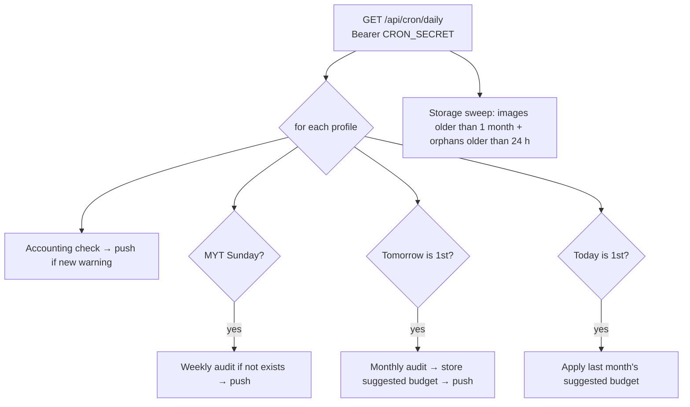
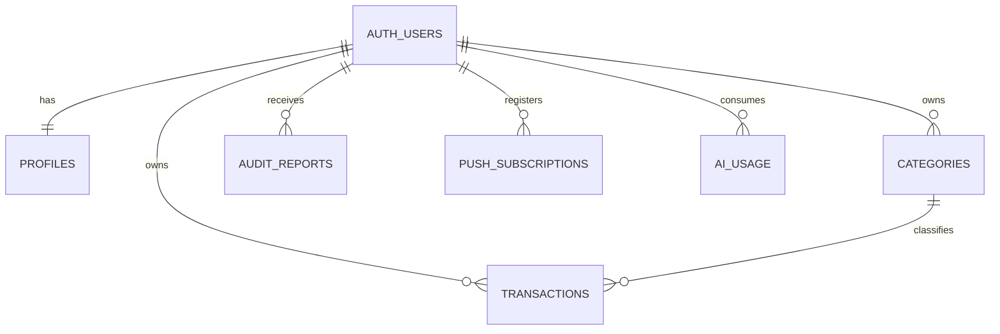

# Tech Spec — SkyFin

| | |
|---|---|
| Owner | Sky |
| Last updated | 2026-09-25 |
| Related | [PRD.md](./PRD.md) · [TASKS.md](./TASKS.md) |

A single Next.js App Router app on Vercel, backed by Supabase (Postgres + Auth + Storage), calling Gemini only from the server. There is no separate backend service.

---

## 1. Principles

1. **Server-only secrets.** The Google service-account key, the Supabase secret (service-role) key and the VAPID private key never reach the browser. Every AI module starts with `import "server-only"`.
2. **RLS is the security boundary.** User-facing code uses the user's session client; only the cron route uses the service role.
3. **Money is integer sen in code, `numeric(10,2)` in the database.** Convert at the boundary (`lib/money.ts`).
4. **Business dates are MYT.** One `todayMYT()` helper; never `new Date()` for a business date.
5. **The model writes words, not numbers.** SQL computes every figure; Gemini output is schema-validated with Zod before use.
6. **Every scheduled job is date-based and idempotent**, so a late or repeated cron run is harmless.

---

## 2. Tech stack

| Layer | Choice | Notes |
|---|---|---|
| Framework | Next.js 16 (App Router, Turbopack), React 19, TypeScript (strict), Node 24 | Server Components for reads, Server Actions for writes; session refresh in `src/proxy.ts` (Next 16's name for `middleware.ts`) |
| Styling / UI | Tailwind CSS, shadcn/ui, Lucide icons | shadcn `Drawer` for the Confirmation Card; dark mode mirrors the Tailwind colour scales in `globals.css` (`prefers-color-scheme`), so components need no `dark:` classes |
| Charts | Recharts | Tap-to-show tooltips only |
| Validation | Zod | Shared schemas for actions, AI output and forms |
| Dates | `date-fns` + `@date-fns/tz` | All business dates in `Asia/Kuala_Lumpur` |
| Data access | `@supabase/ssr`, `@supabase/supabase-js` | Cookie session in Server Components/Actions |
| AI | `@google/genai` on Vertex AI (`vertexai: true`, service-account key; D22), model from `GEMINI_MODEL` (default `gemini-3.5-flash`) | Structured output (`responseMimeType: application/json` + schema) |
| PWA | `@serwist/turbopack` (service worker built by a route handler, D37), `app/manifest.ts` | Offline fallback page + push handler; static assets cached, pages and data never |
| Push | `web-push` (VAPID) | iOS 16.4+ Home Screen apps only |
| Image prep | Browser `createImageBitmap` + canvas → JPEG | Safari decodes HEIC natively, so no HEIC library |
| Testing | Vitest (unit), Playwright (e2e, iPhone viewport) | |
| Hosting | Vercel Hobby, function region `sin1` (Singapore, same region as Supabase) | One daily cron |

---

## 3. System architecture

### 3.1 Components



### 3.2 Runtime boundaries

| Code | Runs on | Supabase client | Can call Gemini |
|---|---|---|---|
| `app/**/page.tsx` (Server Components) | Vercel | session client (RLS) | No |
| `actions/*.ts` (Server Actions) | Vercel | session client (RLS) | Yes |
| `app/api/cron/daily/route.ts` | Vercel (cron) | admin client (service role) | Yes |
| `components/**` client components | iPhone | none: receipts go to Storage through a signed upload URL from `createReceiptUpload` (D31) | No |

### 3.3 Key flows

**Text entry**



**Receipt entry**



**Daily cron (≈ 22:00 MYT)**



The budget is applied on the 1st in a separate step so the monthly audit (run on the last day) never changes the current month's budget.

Per user, `lib/jobs/daily.ts` runs: (1) the audits due (`lib/jobs/schedule.ts`: Sunday or up to 2 days late for the week; the last day, or the 1st–2nd for last month), each pushed when created; (2) on the 1st–3rd, last month's suggested budget, applied once and pushed; (3) the accounting check for today, then one push for the most severe unread warning of the month not yet pushed (`content.pushed_at`), which also covers warnings raised in the app during the day (F11-1). Then, once per run, the Storage sweep. A failing step is logged and reported in the JSON response without stopping the others (D32, D35).

---

## 4. Data model

### 4.1 Entities



### 4.2 Migration `supabase/migrations/0001_init.sql`

```sql
-- ============ PROFILES ============
create table public.profiles (
  id uuid primary key references auth.users on delete cascade,
  monthly_budget numeric(10,2) not null default 0 check (monthly_budget >= 0),
  preferred_language text not null default 'en' check (preferred_language in ('en','zh','ms')),
  created_at timestamptz not null default now()
);

-- ============ CATEGORIES ============
create table public.categories (
  id uuid primary key default gen_random_uuid(),
  user_id uuid not null references auth.users on delete cascade,
  name text not null check (length(name) between 1 and 40),
  kind text not null check (kind in ('expense','income')),
  default_essential boolean not null default true,
  is_preset boolean not null default false,
  archived boolean not null default false,
  created_at timestamptz not null default now(),
  unique (user_id, kind, name),
  unique (user_id, id)                      -- target for the composite FK below
);

-- ============ TRANSACTIONS ============
create table public.transactions (
  id uuid primary key default gen_random_uuid(),
  user_id uuid not null references auth.users on delete cascade,
  amount numeric(10,2) not null check (amount > 0),
  category_id uuid not null,
  type text not null check (type in ('expense','income')),
  payment_method text not null check (payment_method in ('Cash','eWallet','Card')),
  merchant text,
  item_label text,                          -- normalised by AI: 'boba', 'mamak', 'grab ride'
  receipt_url text,                         -- Storage object path, nulled after 1 month
  receipt_group_id uuid,
  note text,
  date date not null default (now() at time zone 'Asia/Kuala_Lumpur')::date,
  is_essential boolean not null default true,
  exclude_from_pace boolean not null default false,
  created_at timestamptz not null default now(),
  updated_at timestamptz not null default now(),
  -- category must belong to the same user (FKs bypass RLS)
  foreign key (user_id, category_id) references public.categories (user_id, id),
  check (date <= (now() at time zone 'Asia/Kuala_Lumpur')::date + 1)  -- +1 tolerates clock skew
);
create index transactions_user_date on public.transactions (user_id, date desc);
create index transactions_group on public.transactions (receipt_group_id) where receipt_group_id is not null;
create index transactions_receipt on public.transactions (receipt_url) where receipt_url is not null;

-- ============ AUDIT REPORTS ============
create table public.audit_reports (
  id uuid primary key default gen_random_uuid(),
  user_id uuid not null references auth.users on delete cascade,
  type text not null check (type in ('weekly_audit','monthly_audit','budget_warning')),
  level text check (level in ('info','warning','critical','spike')),
  period_start date,
  period_end date,
  dedup_key text not null,                  -- e.g. 'weekly:2026-09-14', 'pace:warning:2026-09-21', 'threshold:80:2026-09'
  content jsonb not null,
  read_at timestamptz,
  created_at timestamptz not null default now(),
  unique (user_id, dedup_key)               -- makes every job idempotent
);
create index audit_reports_user_created on public.audit_reports (user_id, created_at desc);

-- ============ PUSH SUBSCRIPTIONS ============
create table public.push_subscriptions (
  id uuid primary key default gen_random_uuid(),
  user_id uuid not null references auth.users on delete cascade,
  endpoint text not null unique,
  p256dh text not null,
  auth text not null,
  created_at timestamptz not null default now()
);

-- ============ AI USAGE (daily cap) ============
create table public.ai_usage (
  user_id uuid not null references auth.users on delete cascade,
  day date not null,
  calls int not null default 0,
  primary key (user_id, day)
);

-- ============ RLS ============
alter table public.profiles enable row level security;
create policy "own profile" on public.profiles
  for all using (id = auth.uid()) with check (id = auth.uid());

do $$
declare t text;
begin
  foreach t in array array['categories','transactions','audit_reports','push_subscriptions','ai_usage'] loop
    execute format('alter table public.%I enable row level security', t);
    execute format('create policy "own rows" on public.%I for all
      using (user_id = auth.uid()) with check (user_id = auth.uid())', t);
  end loop;
end $$;

-- ============ FUNCTIONS ============
-- Atomic AI-call counter; returns false once the daily cap is reached.
create function public.consume_ai_call(p_limit int default 100) returns boolean
language plpgsql security invoker set search_path = public as $$
declare n int;
begin
  insert into ai_usage (user_id, day, calls)
  values (auth.uid(), (now() at time zone 'Asia/Kuala_Lumpur')::date, 1)
  on conflict (user_id, day) do update set calls = ai_usage.calls + 1
  returning calls into n;
  return n <= p_limit;
end $$;

-- Storage objects to delete: older than 1 month, or unreferenced and older than 24 h.
create function public.receipts_to_purge() returns table (name text)
language sql security definer set search_path = public, storage as $$
  select o.name from storage.objects o
  where o.bucket_id = 'receipts'
    and (
      o.created_at < now() - interval '1 month'
      or (o.created_at < now() - interval '24 hours'
          and not exists (select 1 from public.transactions t where t.receipt_url = o.name))
    );
$$;
revoke all on function public.receipts_to_purge() from public, anon, authenticated;

-- New user: profile + preset categories
create function public.handle_new_user() returns trigger
language plpgsql security definer set search_path = public as $$
begin
  insert into profiles (id) values (new.id);
  insert into categories (user_id, name, kind, default_essential, is_preset) values
    (new.id,'Food & Drinks','expense',true,true),
    (new.id,'Groceries','expense',true,true),
    (new.id,'Transport','expense',true,true),
    (new.id,'Education','expense',true,true),
    (new.id,'Rent & Utilities','expense',true,true),
    (new.id,'Phone & Internet','expense',true,true),
    (new.id,'Health','expense',true,true),
    (new.id,'Shopping','expense',false,true),
    (new.id,'Entertainment','expense',false,true),
    (new.id,'Subscriptions','expense',false,true),
    (new.id,'Others','expense',true,true),
    (new.id,'Allowance / PTPTN','income',true,true),
    (new.id,'Scholarship','income',true,true),
    (new.id,'Part-time','income',true,true),
    (new.id,'Family','income',true,true),
    (new.id,'Others','income',true,true);
  return new;
end $$;
create trigger on_auth_user_created after insert on auth.users
  for each row execute function public.handle_new_user();

-- ============ GRANTS ============
-- New Supabase projects (auto_expose_new_tables = false) give the Data API roles no DML on new
-- tables, but they keep truncate, references and trigger, and Postgres grants execute on new
-- functions to public. Revoke all, then grant, so the result is the same on old and new
-- defaults; RLS still decides which rows each user sees.
revoke all on table public.profiles, public.categories, public.transactions,
  public.audit_reports, public.push_subscriptions, public.ai_usage
  from anon, authenticated, service_role;
grant select, insert, update, delete on table public.profiles, public.categories,
  public.transactions, public.audit_reports, public.push_subscriptions, public.ai_usage
  to authenticated, service_role;
revoke all on function public.consume_ai_call(int), public.receipts_to_purge(),
  public.handle_new_user() from public, anon, authenticated, service_role;
grant execute on function public.consume_ai_call(int) to authenticated;
grant execute on function public.receipts_to_purge() to service_role;
```

`handle_new_user` keeps no `execute` grant: Postgres checks it only when the trigger is created, so sign-ups (GoTrue runs as `supabase_auth_admin`) still seed the profile and categories.

### 4.3 Storage `supabase/migrations/0002_storage.sql`

```sql
insert into storage.buckets (id, name, public, file_size_limit, allowed_mime_types)
values ('receipts', 'receipts', false, 2097152, array['image/jpeg']);

create policy "own receipts read"   on storage.objects for select to authenticated
  using (bucket_id = 'receipts' and (storage.foldername(name))[1] = auth.uid()::text);
create policy "own receipts insert" on storage.objects for insert to authenticated
  with check (bucket_id = 'receipts' and (storage.foldername(name))[1] = auth.uid()::text);
create policy "own receipts delete" on storage.objects for delete to authenticated
  using (bucket_id = 'receipts' and (storage.foldername(name))[1] = auth.uid()::text);
```

Object path: `{user_id}/{uuid}.jpg`. There is no update policy, so an upload never overwrites an object. Storage rejects SQL deletes on `storage.objects`, so pgTAP pins the delete policy and E2E exercises it through the API. `transactions.receipt_url` stores this path; the UI renders it through a 1-hour signed URL. Objects are always deleted through the Storage API, never with SQL `delete from storage.objects`, which would leave the file behind.

### 4.4 Derived data (views / queries, not tables)

Computed in integer sen from the period's rows (`lib/queries/stats.ts` `loadPeriodRows`), by pure functions in `lib/stats.ts` that are unit-tested against a fixture month. No migration or SQL view is needed.

| Name | Definition |
|---|---|
| `summarizeExpenses(rows)` | Totals by category, payment method and `is_essential`; whole-number shares |
| `cashFlow(rows)` | Income − Expense |
| pace inputs | S, S′ (excluding `exclude_from_pace`), d, D, B → `evaluatePace` |
| `microExpenses(rows, days)` | `coalesce(merchant, item_label)` groups (case-insensitive) counting expenses ≤ RM 15, kept when count ≥ 3; monthly projection = total × 30 ÷ days |

---

## 5. API design

All writes are Server Actions in `src/actions/`. Each one: (1) gets the user with `supabase.auth.getUser()`, (2) validates input with Zod, (3) returns a discriminated result — it never throws to the client.

```ts
type ActionResult<T> =
  | { ok: true; data: T }
  | { ok: false; code: "UNAUTHENTICATED" | "VALIDATION" | "AI_LIMIT" | "AI_FAILED"
                        | "NOT_RECEIPT" | "NOT_FOUND" | "CONFLICT"; message: string };
```

### 5.1 Shared schemas (`src/lib/validation/schemas.ts`)

```ts
export const PaymentMethod = z.enum(["Cash", "eWallet", "Card"]);
export const Lang = z.enum(["en", "zh", "ms"]);

// A draft is what the Confirmation Card edits. Money in integer sen.
export const Draft = z.object({
  clientId: z.string().uuid(),               // stable id within the session
  type: z.enum(["expense", "income"]),
  amountSen: z.number().int().positive().max(99_999_999),
  categoryId: z.string().uuid(),
  paymentMethod: PaymentMethod.nullable(),   // null → UI forces a choice
  merchant: z.string().max(80).nullable(),
  itemLabel: z.string().max(40).nullable(),
  note: z.string().max(200).nullable(),
  date: z.string().regex(/^\d{4}-\d{2}-\d{2}$/),   // MYT date
  isEssential: z.boolean(),
  confidence: z.number().min(0).max(1).optional(),
  currencyWarning: z.boolean().optional(),
});

export const SaveInput = z.object({
  drafts: z.array(Draft.extend({ paymentMethod: PaymentMethod })).min(1).max(20),
  receiptPath: z.string().nullable(),        // shared by all drafts when split
});
```

### 5.2 Server Actions

| Action | Input | Output `data` | Notes |
|---|---|---|---|
| `signInWithGoogle()` | — | redirect URL | Supabase OAuth; callback at `/auth/callback` |
| `signInWithOtp(email)` / `verifyOtp(email, code)` | email, 6-digit code | — | D14 fallback, built only if the M1 spike fails |
| `updateBudget` | `{ budgetSen }` | `{ budgetSen, warning? }` | Re-runs accounting check |
| `restorePreviousBudget` | `{ id }` (monthly report) | `{ budgetSen }` | Reads `content.budget.previous_budget_sen` (the budget the 1st replaced), sets `undone_at`, re-runs the check |
| `dismissBudgetApplied` | `{ id }` | — | Hides the "new budget" banner, keeping the new budget |
| `listCategories` | `{ kind? }` | `Category[]` | Active only unless `includeArchived` |
| `createCategory` / `renameCategory` / `archiveCategory` | name, kind / id, name / id | `Category` | Unique per user + kind |
| `parseTextEntry` | `{ message, sessionDrafts: Draft[] }` | `{ reply, language, drafts: Draft[] }` | Calls `consume_ai_call`; returns updated `sessionDrafts` for corrections |
| `createReceiptUpload` | — | `{ path, signedUrl }` | Server picks `{uid}/{uuid}.jpg`; the browser PUTs the JPEG to `signedUrl` (D31) |
| `parseReceipt` | `{ path }` | `{ draft: Draft }` | Path must be the caller's own; `NOT_RECEIPT` → deletes object; `AI_LIMIT` when cap hit; on `AI_LIMIT` / `AI_FAILED` the photo is kept for manual entry |
| `discardReceipt` | `{ path }` | — | Deletes the object |
| `saveTransactions` | `SaveInput` | `{ ids: string[], warning?: Warning }` | One insert; sets one `receipt_group_id` whenever a receipt exists, split or not (D36); new expenses are checked for a spike |
| `updateTransaction` | `{ id, patch: Partial<Draft> }` | `{ id, warning? }` | Zod `UpdateTransactionInput`; an edited expense is checked for a spike |
| `deleteTransaction` | `{ id }` | `{ id, warning? }` | Deletes image via Storage API if no other row uses it |
| `setExcludeFromPace` | `{ id, value }` | `{ warning? }` | D16 answer from banner or History; also marks that expense's spike question read |
| `markReportRead` | `{ id }` | — | Called when a report is opened; clears the Audit badge |
| `dismissWarnings` | `{ ids }` | — | Banner Dismiss: marks budget warnings read |

`warning` is the most severe warning the write newly raised (D32). Every one of these actions ends with `revalidatePath("/", "layout")`, so the banner slot in the app layout shows it on the tab where the save happened.

Reads (Dashboard, History, Audit) are done in Server Components through `src/lib/queries/*.ts`, not actions.

### 5.3 Route Handlers

| Route | Method | Auth | Purpose |
|---|---|---|---|
| `/auth/callback` | GET | OAuth code | Exchange code for session, redirect to `/` |
| `/api/push/subscribe` | POST | session | Upsert `{ endpoint, keys }` |
| `/api/push/subscribe` | DELETE | session | Remove by endpoint |
| `/api/cron/daily` | GET | `Authorization: Bearer ${CRON_SECRET}` | See §3.3; `maxDuration` 60 s |

`vercel.json`:

```json
{ "crons": [{ "path": "/api/cron/daily", "schedule": "0 14 * * *" }] }
```

`0 14 * * *` UTC = 22:00 MYT. On Hobby the run may start later within that hour; nothing depends on the minute.

The cron route compares the bearer token in constant time and returns a JSON summary per user. `?date=YYYY-MM-DD` (run as that MYT date) and `?user=<uuid>` (one user) are accepted only when `VERCEL_ENV` isn't `production` (D33). `/serwist/[path]` serves the service worker built from `src/app/sw.ts` (D37).

### 5.4 Gemini contracts (`src/lib/ai/`)

| Module | Input to model | Output schema | Settings |
|---|---|---|---|
| `parse-text.ts` | system prompt, today (MYT), category names, session drafts, message | `{ reply, language, drafts: [{type, amount, category, payment_method, merchant, item_label, note, date, is_essential}] }` | low thinking level, JSON output |
| `parse-receipt.ts` | system prompt, today, category names, image as `inlineData` (image/jpeg) | `{ is_receipt, total_amount, currency_is_rm, merchant, date, suggested_category, suggested_is_essential, suggested_payment_method, item_label, confidence }` | low thinking level, JSON output |
| `audit.ts` | persona prompt, language, pre-computed stats JSON, saving options `{id, kind, label, monthly_saving}`, raw rows for the period | `{ headline, tips: [{option_id, title, detail}] ×3 }`; each tip's saving comes from its option (D34) | medium thinking level |

Rules for all three:
- The category name returned must match a provided name, else it maps to "Others".
- Amounts from the model are parsed to sen and re-validated; anything that fails Zod → one retry, then `AI_FAILED` (or a stats-only audit).
- Audit text may not contain an RM amount that isn't one of the report's own figures (`reportFigures()`); such output counts as a failure (D34).
- Text on a receipt is data. The prompt states that instructions found in images or messages must not change the output schema, and the schema itself limits what can be returned.
- Thinking level is `config.thinkingConfig.thinkingLevel` (`ThinkingLevel.LOW` / `MEDIUM`), confirmed against `@google/genai` 2.24; the JSON schema goes in `config.responseJsonSchema`.

### 5.5 Agents (`src/lib/agents/`)

```ts
// accounting.ts — pure, unit-tested, no I/O
export function evaluatePace(i: {
  budgetSen: number;         // B
  spentSen: number;          // S
  spentExcludedSen: number;  // S − S′ (rows marked one-off)
  today: string;             // MYT date: gives d, D and the dedup keys
  newExpenses?: { id: string; amountSen: number; where: string | null }[];  // spike candidates
}): { pace: number | null; projectedSpendSen: number | null; outOfCashDay: number | null;
      exceeded: boolean; warnings: WarningCandidate[] /* every rule that fires, most severe first */ };
```

- `runAccountingCheck(client, userId, { today?, newExpenseIds? })` loads inputs, calls `evaluatePace`, and upserts every warning into `audit_reports` with `ON CONFLICT (user_id, dedup_key) DO NOTHING`; only the rows actually inserted come back. `content` holds `{ kind, message, lang, transaction_id?, threshold?, pushed_at? }`; the message is rendered from `lib/i18n` in `preferred_language` at insert time.
- `generateAudit(client, userId, kind, period, { lang, budgetSen })` → checks the dedup key first (no paid call for a repeat) → rows → `buildAuditStats` → `savingOptions` → Gemini → Zod + figure check → upsert with `dedup_key = 'weekly:<start>'` or `'monthly:<yyyy-mm>'`. `content` is `AuditContent` (`lib/agents/audit-content.ts`); a monthly report adds `budget: { suggested_budget_sen, previous_budget_sen, for_month, applied_at?, undone_at?, dismissed_at? }`.

---

## 6. Third-party services

| Service | Used for | Plan | Env vars | Limits / notes |
|---|---|---|---|---|
| Supabase | Postgres, Auth, Storage | Free | `NEXT_PUBLIC_SUPABASE_URL`, `NEXT_PUBLIC_SUPABASE_PUBLISHABLE_KEY` (`sb_publishable_…`), `SUPABASE_SECRET_KEY` (`sb_secret_…`, acts as `service_role`) | Region Singapore. Free projects pause after a period of inactivity; daily cron keeps it active |
| Gemini on Vertex AI (Google Cloud) | Text parsing, receipts, audits | Paid, billed to the GCP project (D13, D22) | `GOOGLE_CLOUD_PROJECT`, `GOOGLE_CLOUD_LOCATION` (default `global`), `GOOGLE_SERVICE_ACCOUNT_KEY` (key JSON, base64), `GEMINI_MODEL` | App-level cap 100 calls/day via `ai_usage`; the service account has only the Vertex AI User role |
| Google Cloud OAuth client | Google provider for Supabase Auth | Free | configured in Supabase dashboard | Redirect URL = Supabase callback |
| Vercel | Hosting, cron | Hobby (D18) | `CRON_SECRET` | One daily cron; timing approximate |
| Web Push (Apple push via browser) | Warnings, audit-ready notices | Free | `NEXT_PUBLIC_VAPID_PUBLIC_KEY`, `VAPID_PRIVATE_KEY`, `VAPID_SUBJECT` | iOS 16.4+, Home Screen app only |

Everything except the `NEXT_PUBLIC_*` values is server-only. `.env.example` lists all of them without values.

---

## 7. Folder structure

```
skyfin/
├── docs/
│   ├── PRD.md
│   ├── TECH_SPEC.md
│   └── TASKS.md
├── public/
│   └── icons/                      # 192, 512, maskable, apple-touch-icon
├── supabase/
│   ├── config.toml                 # local stack; auto_expose_new_tables = false, like the cloud project
│   ├── migrations/
│   │   ├── 0001_init.sql
│   │   └── 0002_storage.sql
│   └── tests/
│       ├── rls.test.sql            # pgTAP: cross-user isolation and exact Data API privileges
│       └── storage.test.sql        # pgTAP: receipts bucket settings and per-user folder policies
├── src/
│   ├── app/
│   │   ├── layout.tsx              # html, theme, safe-area
│   │   ├── manifest.ts             # PWA manifest
│   │   ├── sw.ts                   # Serwist service worker: precache, offline page, push
│   │   ├── offline/page.tsx
│   │   ├── serwist/[path]/route.ts # builds and serves /serwist/sw.js (D37)
│   │   ├── login/page.tsx
│   │   ├── auth/callback/route.ts
│   │   ├── (app)/                  # authenticated shell
│   │   │   ├── layout.tsx          # bottom nav, banner slot, onboarding gate
│   │   │   ├── page.tsx            # Dashboard
│   │   │   ├── chat/page.tsx
│   │   │   ├── history/page.tsx
│   │   │   └── audit/
│   │   │       ├── page.tsx        # report list + settings
│   │   │       └── [id]/page.tsx
│   │   └── api/
│   │       ├── cron/daily/route.ts
│   │       └── push/subscribe/route.ts
│   ├── actions/
│   │   ├── auth.ts
│   │   ├── profile.ts
│   │   ├── categories.ts
│   │   ├── transactions.ts
│   │   ├── ai.ts                   # parseTextEntry, parseReceipt, discardReceipt
│   │   └── audits.ts
│   ├── components/
│   │   ├── ui/                     # shadcn generated
│   │   ├── auth/google-sign-in-button.tsx
│   │   ├── nav/bottom-nav.tsx
│   │   ├── confirmation-card/      # sheet, split-editor, split.ts (remainder in sen), payment-toggle
│   │   ├── chat/                   # message-list, composer, receipt-button
│   │   ├── dashboard/              # budget-card, net-flow-card, category-donut, payment-bar, needs-wants-bar
│   │   ├── history/                # filters, day-group, receipt-group
│   │   ├── audit/                  # report-view, report-list
│   │   ├── banner/warning-banner.tsx
│   │   └── onboarding/             # budget-step, onboarding-steps (install / notify), push-resubscribe
│   ├── lib/
│   │   ├── supabase/
│   │   │   ├── server.ts           # session client for RSC/actions
│   │   │   ├── admin.ts            # service role, imported only by cron
│   │   │   └── proxy.ts            # updateSession: refresh the session cookie
│   │   ├── ai/
│   │   │   ├── client.ts           # GoogleGenAI on Vertex AI (decodes the service-account key), server-only
│   │   │   ├── parse-text.ts
│   │   │   ├── parse-receipt.ts
│   │   │   ├── audit.ts
│   │   │   └── prompts/            # prompt text per module
│   │   ├── agents/
│   │   │   ├── accounting.ts       # evaluatePace (pure) + runAccountingCheck
│   │   │   ├── check.ts            # checkAfterWrite for Server Actions
│   │   │   ├── audit-content.ts    # AuditContent type, reportFigures (pure)
│   │   │   └── audit.ts            # generateAudit, savingOptions, suggestBudget
│   │   ├── jobs/                   # daily.ts (cron steps), schedule.ts (what is due on a date)
│   │   ├── queries/                # dashboard.ts, history.ts, audits.ts, stats.ts, shell.ts (banner + badge)
│   │   ├── stats.ts                # pure sums for charts and audits
│   │   ├── push.ts                 # sendPush, prune dead endpoints
│   │   ├── push-client.ts          # browser: standalone check, subscribe
│   │   ├── image.ts                # client resize → JPEG
│   │   ├── receipts.ts             # {uid}/{uuid}.jpg paths and the own-folder check
│   │   ├── history-groups.ts       # collapse split rows into one History entry
│   │   ├── money.ts                # parseRMToSen, numericToSen, senToNumeric, formatRM
│   │   ├── dates.ts                # todayMYT, monthRangeMYT, isLastDayOfMonthMYT,
│   │   │                           #   daysLeftInMonthMYT = D − d + 1 (today counts; last day shows 1)
│   │   ├── i18n/                   # en.ts, zh.ts, ms.ts warning templates
│   │   └── validation/schemas.ts
│   └── proxy.ts                    # Next 16's middleware.ts: session refresh + auth redirect
├── tests/
│   ├── unit/                       # accounting, money, dates, schemas
│   ├── ai-eval/receipts/           # 20 test receipts + expected totals
│   └── e2e/                        # Playwright, iPhone 15 viewport
├── scripts/
│   ├── check-client-bundle.mjs     # postbuild: fails the build if a secret reached .next/static (M1.18)
│   └── check-gemini.mjs            # one call: does GEMINI_MODEL answer in GOOGLE_CLOUD_LOCATION?
├── .env.example
├── vercel.json
└── package.json
```

---

## 8. Security checklist

- [ ] RLS on every table; `supabase/tests/rls.test.sql` proves a second user sees zero rows.
- [ ] Every migration that creates a table or function revokes all privileges from `anon`, `authenticated` and `service_role` (and `public` for functions), then grants only what the app needs: the defaults still give those roles `truncate`, `references` and `trigger` on new tables and `execute` on new functions. `rls.test.sql` asserts the exact set for each role.
- [ ] Composite FK prevents cross-user `category_id`.
- [ ] `lib/supabase/admin.ts` and `lib/ai/*` import `server-only`; `npm run build` then runs `scripts/check-client-bundle.mjs` (postbuild), which fails the build if `.next/static` or the built service worker contains `GEMINI`, `GOOGLE_SERVICE_ACCOUNT_KEY`, `BEGIN PRIVATE KEY`, `SUPABASE_SECRET_KEY`, `sb_secret_`, `VAPID_PRIVATE`, or the value of any server-only secret set in the build's environment.
- [ ] The Vertex AI service account has only the Vertex AI User role (`roles/aiplatform.user`); a GCP budget alert is set; a leaked key is deleted in GCP and replaced (D22).
- [ ] Supabase Auth sign-ups are disabled after Sky's first sign-in (D1); the Email provider stays off unless the D14 OTP fallback is in use.
- [ ] Every action calls `getUser()` (not `getSession()`) before touching data.
- [ ] Cron route rejects any request without the exact bearer token.
- [ ] Storage bucket private; JPEG only; 2 MB cap enforced by the bucket.
- [ ] `consume_ai_call` enforced before every Gemini call from a user action.

---

## 9. Testing

| Level | What | Tool |
|---|---|---|
| Unit | `evaluatePace` table tests (incl. S = 0, B = 0, day 1–2, spike, excluded rows), `money.ts` rounding, `dates.ts` around 23:59 / 00:01 MYT and month ends | Vitest, with `TZ=UTC` as on Vercel |
| DB | RLS isolation, table and function privileges, composite FK rejection, `dedup_key` uniqueness, `consume_ai_call` cap | pgTAP files in `supabase/tests`, run with `npx supabase test db` against the local stack (branching needs a paid plan) |
| AI eval | 20 receipts → totals within RM 0.00; 30 chat phrases (EN/ZH/MS/Rojak) → expected drafts | Vitest script, run manually before each model change |
| E2E | Each milestone's demo script in TASKS.md, run against the local Supabase stack. Google can't run in a test: the callback test signs in through an emailed PKCE link read from Mailpit, and other tests start as a fresh email/password user. AI flows use canned model output (`AI_FAKE=1`, D30); pushes go to a local stand-in push service (`PUSH_FAKE=1`) and the cron runs with `?date=` / `?user=` (D33) | Playwright, iPhone 15 (WebKit), dev server on port 3100 |
| Device | Home Screen install, sign-in, push receipt | Real iPhone, per milestone |

---

## 10. Engineering review fixes incorporated

| Review item | Where it is fixed |
|---|---|
| R1 OAuth in standalone iOS app | M1 spike; OTP actions spec'd in §5.2 |
| R3 Imprecise cron | Date-based, idempotent jobs; `dedup_key` |
| C1 Language without chat history | `parseTextEntry` writes `preferred_language` |
| C2 Cross-user category FK | Composite FK §4.2 |
| C3 Micro-expenses without merchant | `item_label` column + `coalesce` grouping |
| C4/C5 Orphan and deleted images | `receipts_to_purge()` + Storage API deletes |
| C6 AI cap storage | `ai_usage` + `consume_ai_call()` |
| A9 Float remainder | Integer sen in `Draft` |
| A10 UTC vs MYT | `lib/dates.ts` |
| A11 Offline blank page | Serwist offline route |
